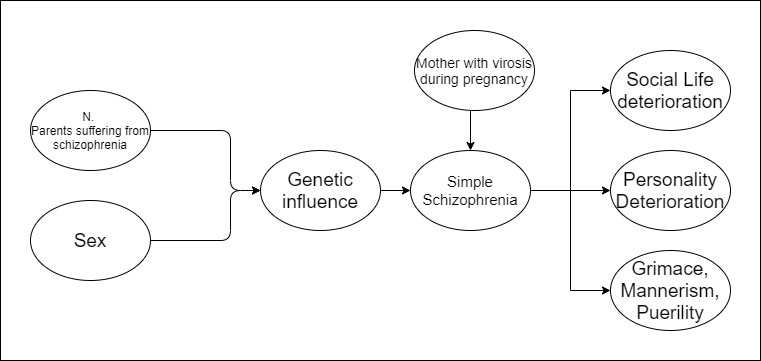

# Bayesian networks for the diagnosis of psychiatric diseases
The repository contains the project realized for the *FAIKR - Mod. 3* course of the [Master's degree in Artificial Intelligence](https://corsi.unibo.it/2cycle/artificial-intelligence), at Alma Mater Studiorum, University of Bologna.

The projects is realized by:
* Alex Costanzino ([arcanoXIII](https://github.com/arcanoXIII)), alex.costanzino@studio.unibo.it;
* Xiaowei Wen ([WenXiaowei](https://github.com/WenXiaowei)), xiaowei.wen@studio.unibo.it.

## Contents
* `BN_psychiatric-diseases.ipynb` is the main notebook;
* `report.pdf` is the report file.
* `network.png` the structure of the network:

## Main libraries
* [pgmpy](https://pgmpy.org/) 0.1.13;
* [NetworkX](https://networkx.org/) 2.5;
* [Numpy](https://numpy.org/) 1.20.0;
* [matplotlib](https://matplotlib.org/) 3.4.2;

Further details can be found in the report.

## License

This project is licensed under the MIT License - see the [LICENSE](LICENSE) file for further details.
